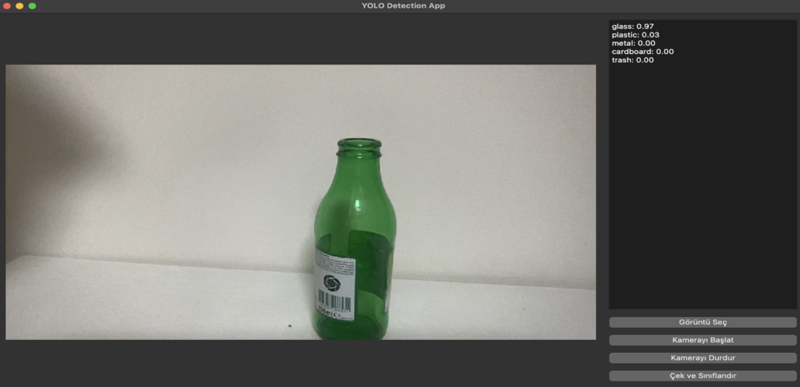
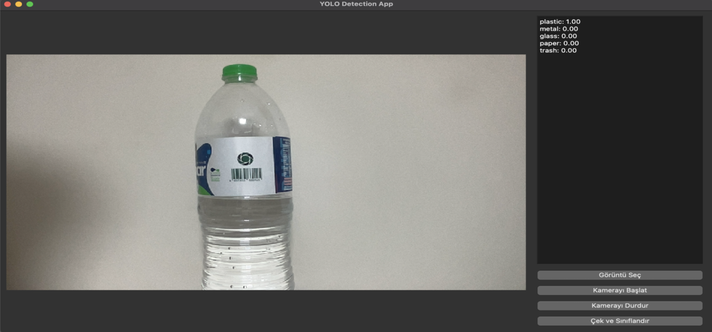
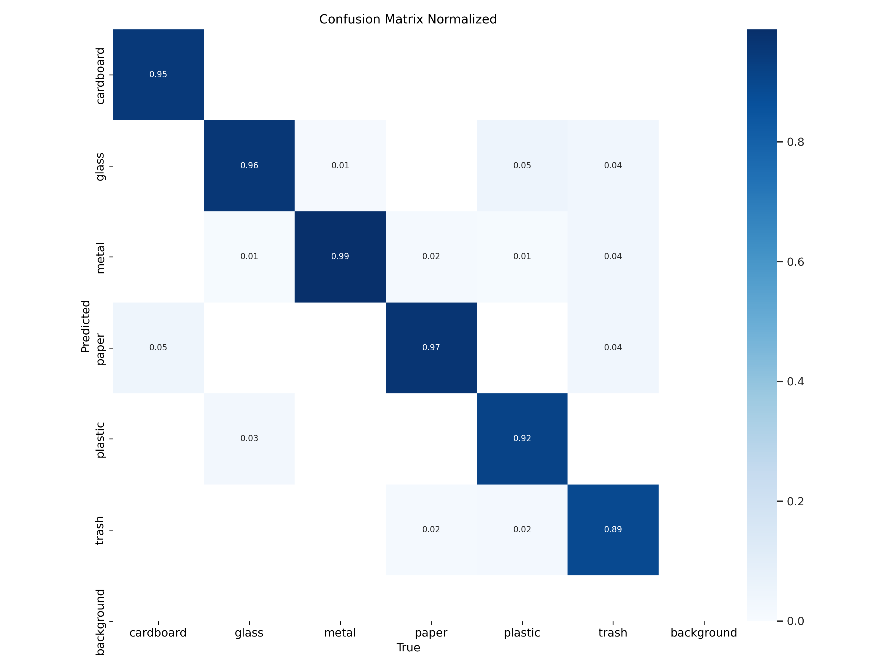
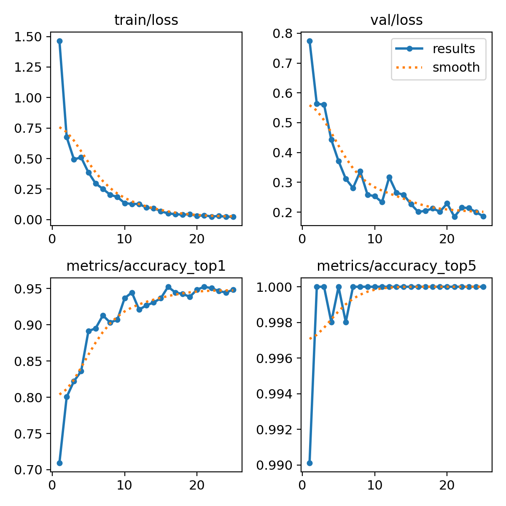
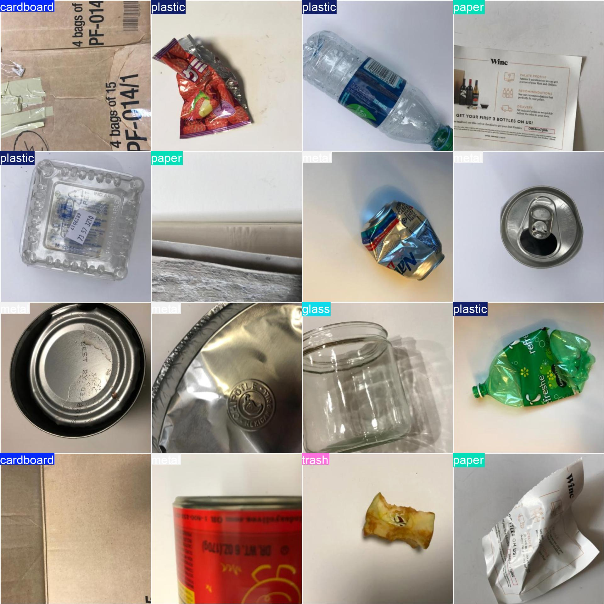
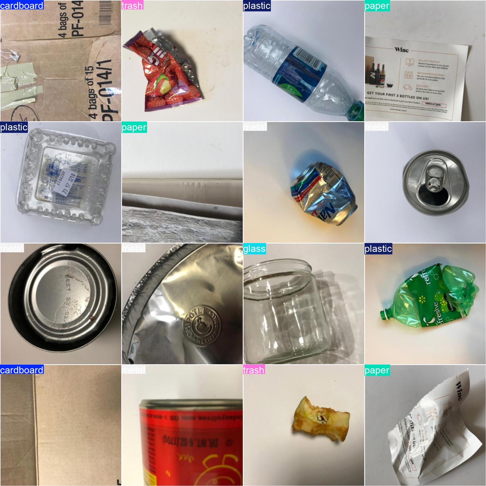

# Smart Waste Sorting


A desktop application that classifies waste materials (cardboard, glass, plastic, metal, paper, trash) in real time using a custom-trained **YOLOv8** model, wrapped in a **PyQt5** graphical interface. The app supports classification from static images as well as a live webcam feed.

## Features

- 🖼️ **Image classification** — load any image file and get instant predictions with confidence scores.
- 🎥 **Live camera feed** — start/stop a webcam stream and classify captured frames on demand.
- 📊 **Top-5 results panel** — displays the top predicted classes with their confidence percentages.
- 🖥️ **Simple, dark-themed GUI** built with PyQt5.

## Demo

| Glass Detection | Plastic Detection |
|:---:|:---:|
|  |  |

## Model Performance

The classification model was trained and validated with the following results:

<table>
<tr>
<td align="center"><b>Normalized Confusion Matrix</b><br></td>
<td align="center"><b>Training Results</b><br></td>
</tr>
<tr>
<td align="center"><b>Validation Batch — Ground Truth</b><br></td>
<td align="center"><b>Validation Batch — Predictions</b><br></td>
</tr>
</table>

## Project Structure

```
Smart-Waste-Sorting/
├── src/
│   └── app.py              # PyQt5 GUI application
├── docs/                   # Validation metrics and demo screenshots
├── requirements.txt        # Python dependencies
├── LICENSE
└── README.md
```

## Installation

```bash
git clone https://github.com/Kambekcek/Smart-Waste-Sorting.git
cd Smart-Waste-Sorting
python -m venv venv
source venv/bin/activate   # on Windows: venv\Scripts\activate
pip install -r requirements.txt
```

> **⚠️ Note on model weights:** the trained model weights (`best.pt`) are **not included** in this repository due to their file size. Before running the application, place your own trained YOLOv8 weights at `models/best.pt`, or train a new model using the [Ultralytics YOLOv8](https://github.com/ultralytics/ultralytics) framework on your own waste-classification dataset.

## Usage

```bash
python src/app.py
```

1. Click **"Görüntü Seç"** to load an image from disk, or **"Kamerayı Başlat"** to start the webcam feed.
2. Click **"Çek ve Sınıflandır"** to run the classification on the current frame.
3. View the top-5 predicted classes and confidence scores in the right-hand panel.
4. Click **"Kamerayı Durdur"** to stop the webcam stream.

## License

This project is licensed under the [MIT License](LICENSE).

---

## Türkçe Özet

Bu proje, **YOLOv8** tabanlı özel eğitilmiş bir model kullanarak atık malzemeleri (cam, plastik vb.) gerçek zamanlı olarak sınıflandıran, **PyQt5** ile geliştirilmiş bir masaüstü uygulamasıdır. Statik görsellerden veya canlı kamera görüntüsünden sınıflandırma yapılabilir. **Model ağırlıkları (`best.pt`) dosya boyutu nedeniyle bu depoya dahil edilmemiştir**; uygulamayı çalıştırmadan önce kendi eğittiğiniz ağırlıkları `models/best.pt` yoluna eklemeniz gerekmektedir.
